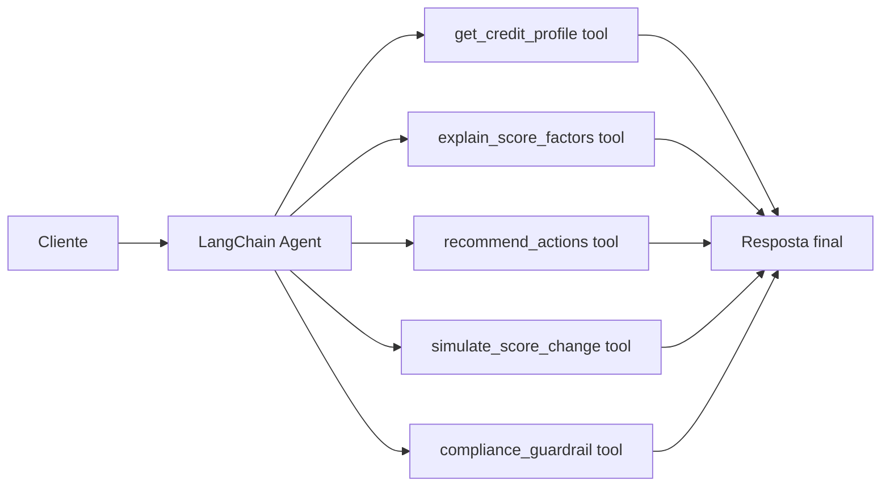

# Score Agente

Um MVP de `LangChain Agents` para interação com clientes em um cenário de explicação de score de crédito. O projeto foi desenhado para atuar como um `customer-facing explanation agent`, capaz de consultar o perfil de crédito, explicar os principais drivers do score, sugerir ações de melhoria e produzir simulações educativas sem prometer aprovação de crédito.

## Visão Geral

O sistema responde perguntas como:

- por que meu score caiu?
- quais fatores estão pesando mais?
- o que eu posso fazer para melhorar?
- se eu reduzir a utilização do cartão, o score tende a subir?

O fluxo foi estruturado com `LangChain Agents` e `tools` específicas para crédito, criando uma separação clara entre:

- orquestração conversacional;
- acesso ao perfil do cliente;
- explicação dos fatores;
- recomendação de ações;
- guardrails de compliance.

## Arquitetura



## Estrutura do Projeto

- [src/sample_data.py](/Users/flaviagaia/Documents/CV_FLAVIA_CODEX/Score_agente/src/sample_data.py)
  - base demo de perfis de crédito.
- [src/tools.py](/Users/flaviagaia/Documents/CV_FLAVIA_CODEX/Score_agente/src/tools.py)
  - ferramentas do agente com `@tool`.
- [src/agent.py](/Users/flaviagaia/Documents/CV_FLAVIA_CODEX/Score_agente/src/agent.py)
  - fábrica do agente LangChain e modo fallback.
- [app.py](/Users/flaviagaia/Documents/CV_FLAVIA_CODEX/Score_agente/app.py)
  - interface em Streamlit.
- [main.py](/Users/flaviagaia/Documents/CV_FLAVIA_CODEX/Score_agente/main.py)
  - execução rápida do cenário principal.
- [tests/test_agent.py](/Users/flaviagaia/Documents/CV_FLAVIA_CODEX/Score_agente/tests/test_agent.py)
  - validação da camada principal de explicação.

## Como o LangChain Agent foi modelado

O agente usa a API atual de `create_agent()` do LangChain, com:

- `system_prompt` especializado em score de crédito;
- `tools` registradas com `@tool`;
- `tool calling` para grounded answers;
- fallback determinístico quando não há `OPENAI_API_KEY`.

### Runtime modes

1. `langchain_agent`
   - usado quando existe `OPENAI_API_KEY`;
   - o agente conversa com um modelo compatível e chama ferramentas antes de responder.
2. `deterministic_fallback`
   - usado quando não há chave configurada;
   - mantém o mesmo contrato de saída e demonstra a arquitetura localmente.

## Ferramentas do Agente

### `get_credit_profile`
Retorna o perfil estruturado do cliente.

### `explain_score_factors`
Traduz o score em linguagem acessível, destacando forças e fatores de pressão.

### `recommend_actions`
Sugere próximos passos concretos para melhorar o perfil de crédito.

### `simulate_score_change`
Calcula uma estimativa educacional de melhoria do score com base em redução de utilização e atrasos.

### `compliance_guardrail`
Gera uma diretriz de linguagem segura para contexto regulado.

## Modelo de Dados

Os perfis demo contêm:

- `customer_id`
- `name`
- `score`
- `score_band`
- `on_time_payment_ratio`
- `credit_utilization_pct`
- `recent_late_payments`
- `active_accounts`
- `hard_inquiries_6m`
- `negative_records`
- `main_drivers`

## Guardrails e Compliance

O projeto foi desenhado para evitar respostas perigosas em contexto de crédito:

- não promete aprovação;
- não trata simulação como previsão oficial;
- não inventa dados fora do perfil consultado;
- reforça caráter educativo da explicação;
- separa recomendação operacional de aconselhamento financeiro formal.

## Execução Local

### Execução rápida

```bash
python3 main.py
```

### Testes

```bash
python3 -m unittest discover -s tests -v
```

### Streamlit

```bash
streamlit run app.py
```

## Exemplo de resultado

No cenário padrão:

- `customer_id`: `CRED-1002`
- `runtime_mode`: `deterministic_fallback`
- perfil em faixa `fair`
- explicação inclui fatores como:
  - alta utilização de crédito
  - atrasos recentes
  - consultas recentes
- resposta também traz ações recomendadas e simulação educativa

## Próximas Evoluções

- memória conversacional;
- histórico de perguntas por cliente;
- integração com banco relacional;
- autenticação;
- política de resposta com templates regulatórios;
- avaliação automática de groundedness das respostas.

---

# English Version

`Score Agente` is a `LangChain Agents` MVP for customer-facing credit score explanation.

The system is designed to:

- retrieve a customer credit profile;
- explain key score drivers;
- recommend improvement actions;
- simulate educational score changes;
- enforce compliance-oriented answer guardrails.

## Technical Highlights

- current `LangChain` agent API with `create_agent()`;
- domain-specific tools defined with `@tool`;
- fallback runtime for local reproducibility;
- Streamlit interface for inspection and interaction;
- deterministic tests for the explanation layer.
