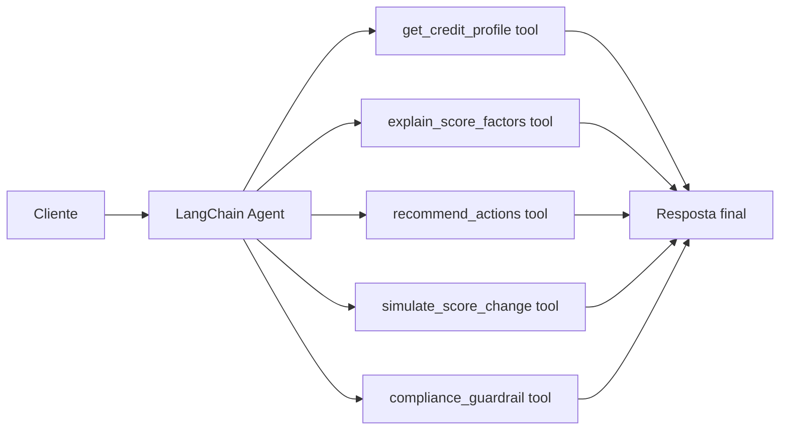

# Score Agente

Um MVP de `LangChain Agents` para interação com clientes em um cenário de explicação de score de crédito. O projeto foi desenhado para atuar como um `customer-facing explanation agent`, capaz de consultar o perfil de crédito, explicar os principais drivers do score, sugerir ações de melhoria e produzir simulações educativas sem prometer aprovação de crédito.

## Visão Geral

O sistema responde perguntas como:

- por que meu score caiu?
- quais fatores estão pesando mais?
- o que eu posso fazer para melhorar?
- se eu reduzir a utilização do cartão, o score tende a subir?

O fluxo foi estruturado com `LangChain Agents` e `tools` específicas para crédito, criando uma separação clara entre:

- orquestração conversacional;
- acesso ao perfil do cliente;
- explicação dos fatores;
- recomendação de ações;
- guardrails de compliance.

## Arquitetura



## Topologia de Execução

O fluxo foi desenhado como um `tool-calling agent` com separação explícita entre:

1. `interaction layer`
   - recebe a pergunta do cliente e o identificador do perfil
2. `agent orchestration layer`
   - decide quando consultar ferramentas e como consolidar a resposta
3. `credit explanation tools`
   - encapsulam recuperação, explicação, recomendação, simulação e guardrails
4. `presentation layer`
   - expõe o fluxo via CLI e Streamlit

Do ponto de vista funcional, o agente responde em duas etapas:

- primeiro consulta os dados e sinais relevantes do cliente;
- depois consolida a resposta em linguagem acessível, mantendo guardrails de compliance.

## Estrutura do Projeto

- [src/sample_data.py](/Users/flaviagaia/Documents/CV_FLAVIA_CODEX/Score_agente/src/sample_data.py)
  - base demo de perfis de crédito.
- [src/tools.py](/Users/flaviagaia/Documents/CV_FLAVIA_CODEX/Score_agente/src/tools.py)
  - ferramentas do agente com `@tool`.
- [src/agent.py](/Users/flaviagaia/Documents/CV_FLAVIA_CODEX/Score_agente/src/agent.py)
  - fábrica do agente LangChain e modo fallback.
- [app.py](/Users/flaviagaia/Documents/CV_FLAVIA_CODEX/Score_agente/app.py)
  - interface em Streamlit.
- [main.py](/Users/flaviagaia/Documents/CV_FLAVIA_CODEX/Score_agente/main.py)
  - execução rápida do cenário principal.
- [tests/test_agent.py](/Users/flaviagaia/Documents/CV_FLAVIA_CODEX/Score_agente/tests/test_agent.py)
  - validação da camada principal de explicação.

## Como o LangChain Agent foi modelado

O agente usa a API atual de `create_agent()` do LangChain, com:

- `system_prompt` especializado em score de crédito;
- `tools` registradas com `@tool`;
- `tool calling` para grounded answers;
- fallback determinístico quando não há `OPENAI_API_KEY`.

### Decisões de design

- `create_agent()`
  - usado como ponto central de composição do agente
- `HumanMessage`
  - leva para o runtime o `customer_id` e a pergunta do cliente
- `system_prompt`
  - restringe o comportamento para explicação responsável, sem promessas impróprias
- `@tool`
  - transforma funções de domínio em capacidades chamáveis pelo agente

Esse desenho mantém o agente simples, auditável e próximo do padrão atual do ecossistema `LangChain`.

### Runtime modes

1. `langchain_agent`
   - usado quando existe `OPENAI_API_KEY`;
   - o agente conversa com um modelo compatível e chama ferramentas antes de responder.
2. `deterministic_fallback`
   - usado quando não há chave configurada;
   - mantém o mesmo contrato de saída e demonstra a arquitetura localmente.

### Contrato de retorno

Tanto no modo com LLM quanto no fallback, o método `ask_credit_agent()` retorna um dicionário com:

```json
{
  "runtime_mode": "langchain_agent | deterministic_fallback",
  "answer": "texto final entregue ao cliente"
}
```

Esse contrato único facilita troca de runtime sem alterar a interface consumidora.

## Ferramentas do Agente

### `get_credit_profile`
Retorna o perfil estruturado do cliente.

Função técnica:
- recuperação do registro consultado;
- serialização em JSON;
- localização de campos customer-facing como `score_band` e `main_drivers`.

### `explain_score_factors`
Traduz o score em linguagem acessível, destacando forças e fatores de pressão.

Função técnica:
- interpreta razão de pagamentos em dia;
- avalia utilização de crédito;
- incorpora atrasos, registros negativos e consultas recentes;
- produz explicação grounded no perfil real.

### `recommend_actions`
Sugere próximos passos concretos para melhorar o perfil de crédito.

Função técnica:
- converte sinais de risco em recomendações operacionais;
- evita generalidades excessivas;
- mantém resposta prática e centrada em ações.

### `simulate_score_change`
Calcula uma estimativa educacional de melhoria do score com base em redução de utilização e atrasos.

Função técnica:
- aplica uma heurística simples de ganho potencial;
- limita a saída a caráter ilustrativo;
- impede leitura da simulação como previsão oficial.

### `compliance_guardrail`
Gera uma diretriz de linguagem segura para contexto regulado.

Função técnica:
- reforça linguagem educativa;
- bloqueia promessa de aprovação;
- separa explicação operacional de aconselhamento financeiro formal.

## Modelo de Dados

Os perfis demo contêm:

- `customer_id`
- `name`
- `score`
- `score_band`
- `on_time_payment_ratio`
- `credit_utilization_pct`
- `recent_late_payments`
- `active_accounts`
- `hard_inquiries_6m`
- `negative_records`
- `main_drivers`

### Exemplo de perfil

```json
{
  "customer_id": "CRED-1002",
  "name": "Bruno Lima",
  "score": 618,
  "score_band": "regular",
  "on_time_payment_ratio": 0.83,
  "credit_utilization_pct": 71,
  "recent_late_payments": 2,
  "active_accounts": 4,
  "hard_inquiries_6m": 4,
  "negative_records": 1,
  "main_drivers": "Alta utilização do crédito e atrasos recentes estão pressionando o score para baixo."
}
```

## Estratégia de Explicação

O pipeline de explicação segue esta lógica:

1. recuperar o perfil do cliente;
2. localizar campos técnicos para linguagem customer-facing;
3. identificar fatores positivos;
4. identificar fatores de pressão;
5. sugerir ações práticas;
6. anexar uma simulação educativa;
7. reforçar guardrails regulatórios.

Essa ordem deixa a resposta mais transparente e previsível do que uma geração livre de ponta a ponta.

## Guardrails e Compliance

O projeto foi desenhado para evitar respostas perigosas em contexto de crédito:

- não promete aprovação;
- não trata simulação como previsão oficial;
- não inventa dados fora do perfil consultado;
- reforça caráter educativo da explicação;
- separa recomendação operacional de aconselhamento financeiro formal.

## Compatibilidade de Ambiente

O projeto executa corretamente neste ambiente, mas o stack atual do `LangChain` emite um warning conhecido no `Python 3.14` por dependência transitiva de componentes compatíveis com `Pydantic v1`.

Isso significa:

- o projeto roda e os testes passam;
- o warning é do ecossistema, não da implementação do agente;
- em ambiente de produção, o ideal é preferir uma versão de Python já homologada pelo stack do framework.

## Interface Streamlit

O app em [app.py](/Users/flaviagaia/Documents/CV_FLAVIA_CODEX/Score_agente/app.py) funciona como um `agent inspection console`:

- seleção do cliente consultado;
- entrada da pergunta do cliente;
- exibição do perfil estruturado;
- visualização do modo de execução;
- resposta final produzida pelo agente;
- explicação da arquitetura e das ferramentas usadas.

Isso ajuda a equipe técnica a entender como o agente foi montado sem depender apenas do código fonte.

## Validação

Os testes em [tests/test_agent.py](/Users/flaviagaia/Documents/CV_FLAVIA_CODEX/Score_agente/tests/test_agent.py) cobrem:

- retorno mínimo do agente no fallback;
- presença de explicação com referência ao score;
- geração de ações recomendadas;
- existência de simulação educativa.

## Execução Local

### Execução rápida

```bash
python3 main.py
```

### Testes

```bash
python3 -m unittest discover -s tests -v
```

### Streamlit

```bash
streamlit run app.py
```

## Exemplo de resultado

No cenário padrão:

- `customer_id`: `CRED-1002`
- `runtime_mode`: `deterministic_fallback`
- perfil em faixa `regular`
- explicação inclui fatores como:
  - alta utilização de crédito
  - atrasos recentes
  - consultas recentes
- resposta também traz ações recomendadas e simulação educativa

## Limitações Conhecidas

- base demo pequena e estática;
- sem memória conversacional persistente;
- sem integração com bureau ou fonte externa real;
- heurística de simulação simplificada;
- sem avaliação automática de factualidade da resposta.

## Próximas Evoluções

- memória conversacional;
- histórico de perguntas por cliente;
- integração com banco relacional;
- autenticação;
- política de resposta com templates regulatórios;
- avaliação automática de groundedness das respostas.

---

# English Version

`Score Agente` is a `LangChain Agents` MVP for customer-facing credit score explanation.

The system is designed to:

- retrieve a customer credit profile;
- explain key score drivers;
- recommend improvement actions;
- simulate educational score changes;
- enforce compliance-oriented answer guardrails.

## Technical Highlights

- current `LangChain` agent API with `create_agent()`;
- domain-specific tools defined with `@tool`;
- fallback runtime for local reproducibility;
- Streamlit interface for inspection and interaction;
- deterministic tests for the explanation layer.

## Additional Technical Notes

- unified output contract across runtime modes;
- localized customer-facing explanation layer;
- explicit compliance guardrail tool;
- educational simulation separated from factual profile explanation;
- lightweight architecture suitable for expansion into authenticated, production-grade support flows.
